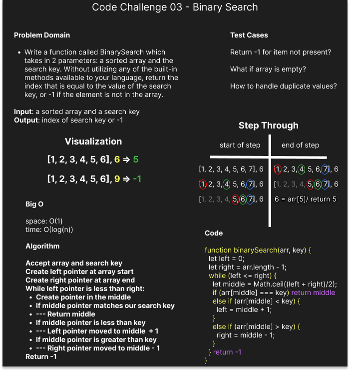

# Array Binary Search

Write a function called BinarySearch which takes in 2 parameters: a sorted array and the search key. Without utilizing any of the built-in methods available to your language, return the index of the array’s element that is equal to the value of the search key, or -1 if the element is not in the array.

## Whiteboard Process

## Approach & Efficiency

We used a mulitple pointers approach to track the beginning, end and middle of the array. This is all the info needed to implement a binary search on a sorted array leading to a space complexity of O(1). Binary search scales logarithmically with it's inputs and leads to a time complexity of O(log(n)).

## Attribution

Collaborated with John Chavez and verified our approach with resources from Colt Steele's DSA udemy course.
