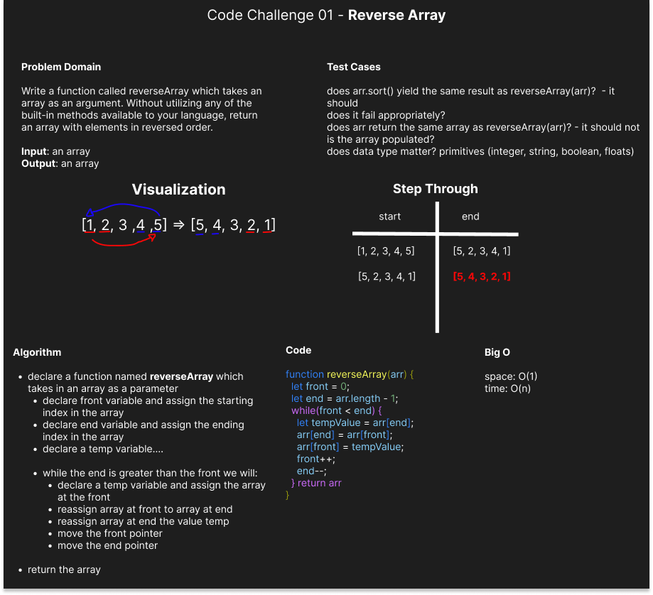

# Array-Reverse

Write a function called reverseArray which takes an array as an argument. Without utilizing any of the built-in methods available to your language, return an array with elements in reversed order.

## Whiteboard Process

## Approach & Efficiency

We used a mulitple pointers approach and modified the array in place. This is the superior option as it has a constant space complexity.

## Attribution

Collaborated with Melanie Johnston and used template from Ryan Gallaway
