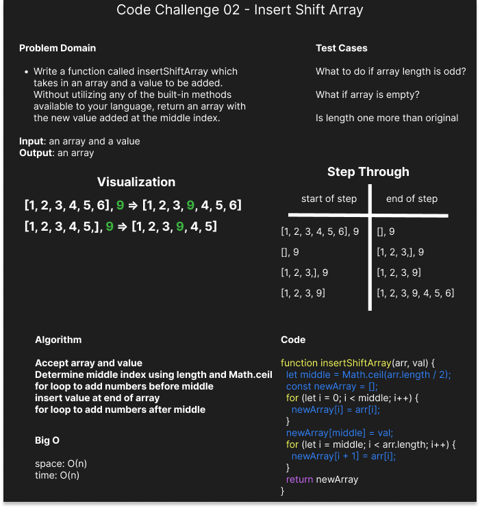

# Insert Shift Array

Write a function called insertShiftArray which takes in an array and a value to be added. Without utilizing any of the built-in methods available to your language, return an array with the new value added at the middle index

## Whiteboard Process

## Approach & Efficiency

We decided to accomplish this task by creating a new array and rebuilding it incrementally to match our desired output. Because we are looping over the array in it's entirety and storing a copy in it's entirety both space and time complexity are O(n).

## Notes

I am trying to find the right colors for my code blocks and I see now that blue on black is not as readable as I thought at first. Sorry I will change it going forward.
