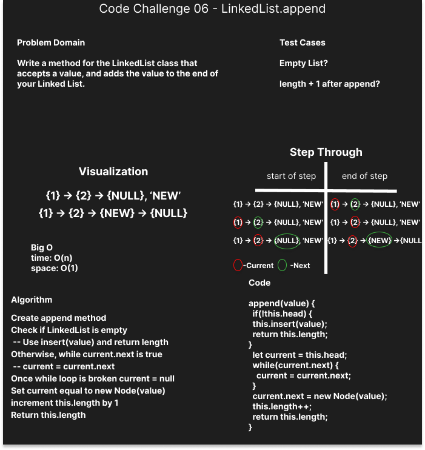

# Singly Linked List

Implement LinkedList and Node classes

## Challenge

Build a LinkedList class and some basic methods. More methods will be added during code challenges.

## Approach & Efficiency

The only difference I made to the live-demo was creating a length property and testing that it updates correctly when updating. I think this feature will be useful when wanting to access a specific node. It also is a good troubleshooting feature as when adding or deleting nodes I can check against the length property.

## API

### Day 1 of Linked Lists

insert(value) - Add a node with the desired value, set it to the HEAD and set the oldHEAD to the newHEAD's next
includes(value) - Check all nodes for the desired value. Returns a bool.
toString() - Provides a visual representation of the LL in a console log.

### Day 2 of Linked Lists

append(value) - Set a new Node to the end of the linked list and increment length.
insertBefore(searchValue, insertValue) - Find a node with a given value and insert a new Node before it. searchValue not found appends the insertValue.
insertAfter(searchValue, insertValue) - Find a node with a given value and insert after it. searchValue not found appends the insertValue.

