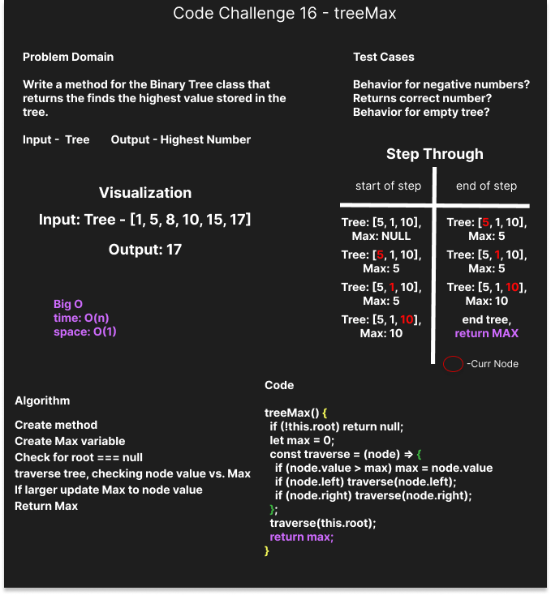
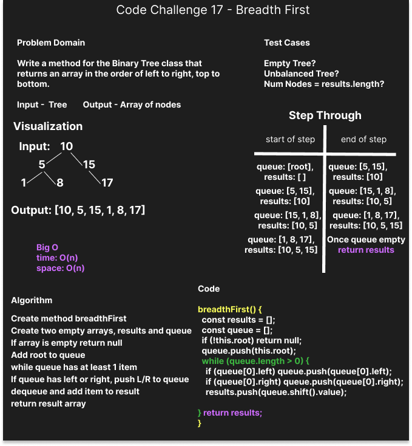
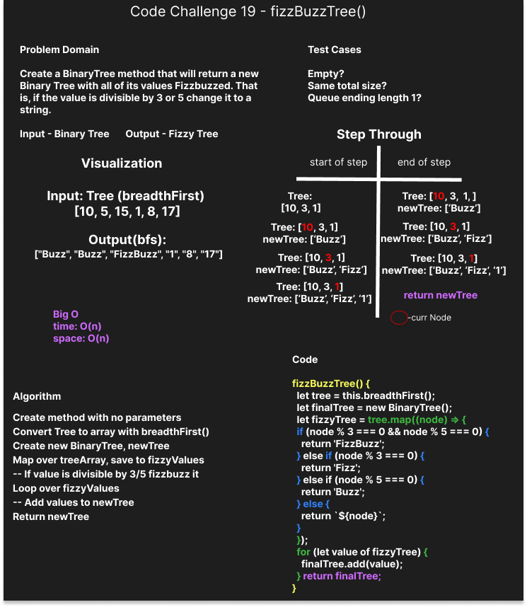

# Trees

Implement Binary Tree and Binary Search Tree

## Challenge

Build 3 classes: Node, BinaryTree, and BinarySearchTree

## Approach & Efficiency

BinaryTree must be able to convert itself into an array for each order type (pre-, in-, and post-order). BinarySearchTree should sort to enable a search with time of O(log(n)).

## API

### Day 1 of Trees and BSTs

#### Binary Tree

preOrder() - Convert tree into array.

inOrder() - Convert tree into array.

postOrder() - Convert tree into array.

#### Binary Search Tree

add(value) - Inserts a value into a tree while maintaining its sort (left is less than root, right is greater than root).

includes(value) - Searches an array for a value and returns true if found, false if not found.

### Day 2 of Trees and BSTs

max() - Finds the highest value in a numbers only tree.

### Day 3 of Trees and BSTs

breadthFirst() - Returns an array of all nodes in a tree in the order of left-to-right, top-to-bottom.

### Day 4 of Trees and BSTs

fizzBuzzTree() - Converts all items to a string, the string differs whether each item is divisble by 3, 5, or 15.

## Attribution

Collaborated with Jordan Covington, Joseph Davitt, Ashwini Uppal, Steve Gant, and Brenda Jow. Also relied on examples provided by educational materials from Colt Steele.
